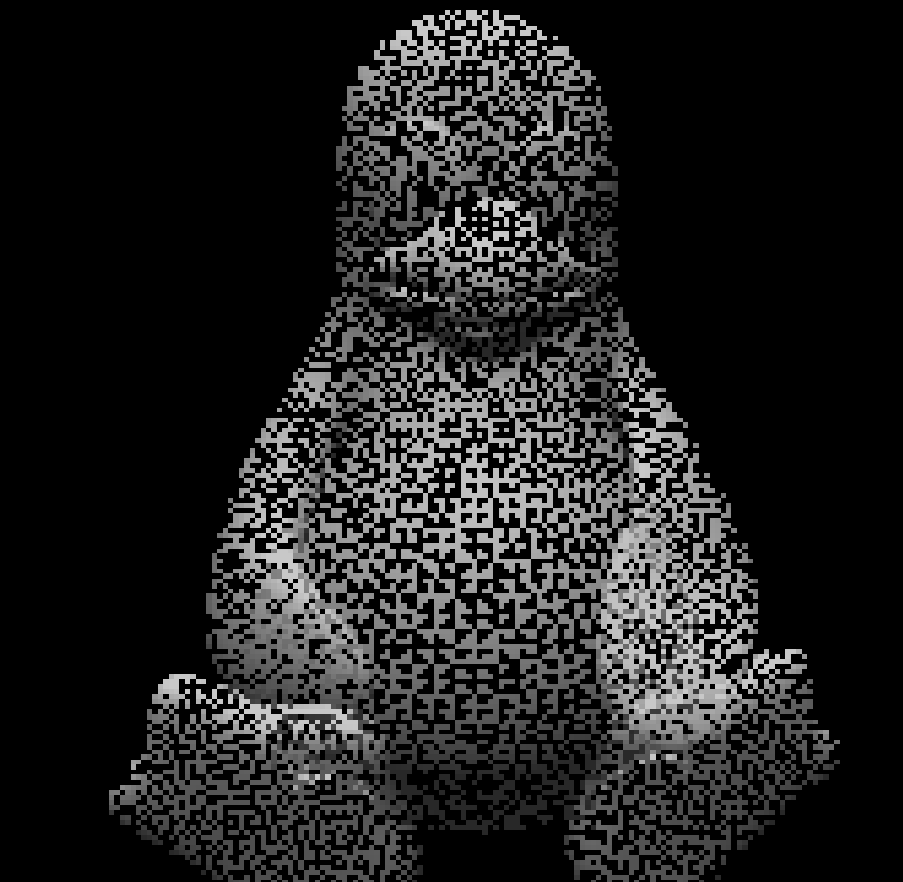
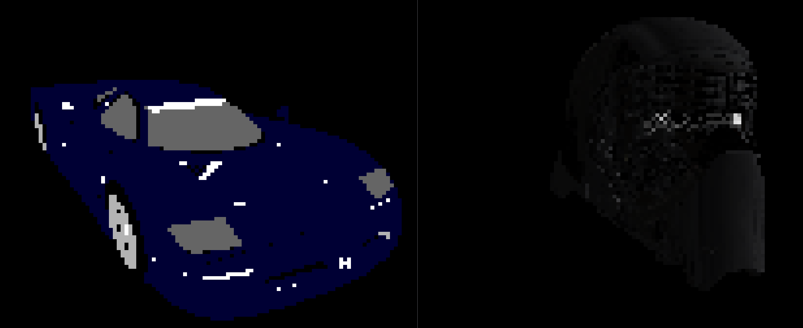
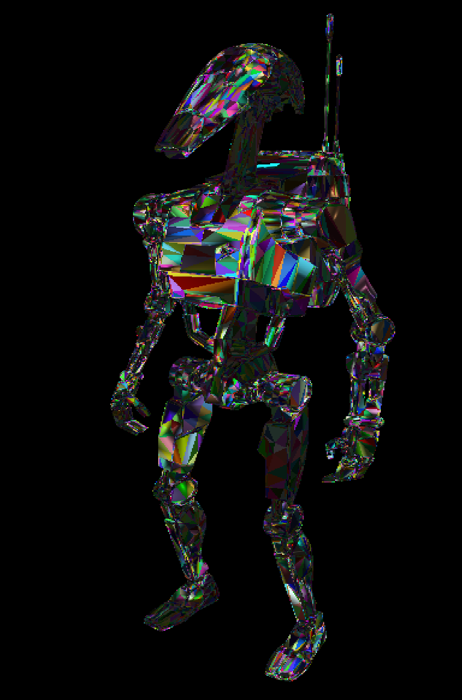

# objview

A zero-dependency terminal-based .obj wavefront viewer. Outputs images in ANSI format.

To build:

```bash
make prod
```


##### Usage:

 `./objview [options] <file.obj>`

##### Options:

-f, --fps N        Target FPS (default 60)

-r, --rotate       Start with auto rotation

-s, --speed N      Rotation speed (rad/sec)

-c  --color R,G,B  Change display color

-b  --bcolor R,G,B Change background color

-h, --help         Show this help

-v, --version      Show version

##### Controls (runtime):

q  quit

t  toggle rotation

r  reset model

h  left

l  right

j  up

k  down

u  zoom in

i  zoom out

y  increase brightness

o  decrease brightness

J  rotate left

L  rotate right

J  rotate up

K  rotate down

Y  rotate in

O  rotate out

U  double scaling

I  half scaling


## TODO:
- Fix textures
- Add additional file support
- Clean up & make more user-friendly

#### Images:






